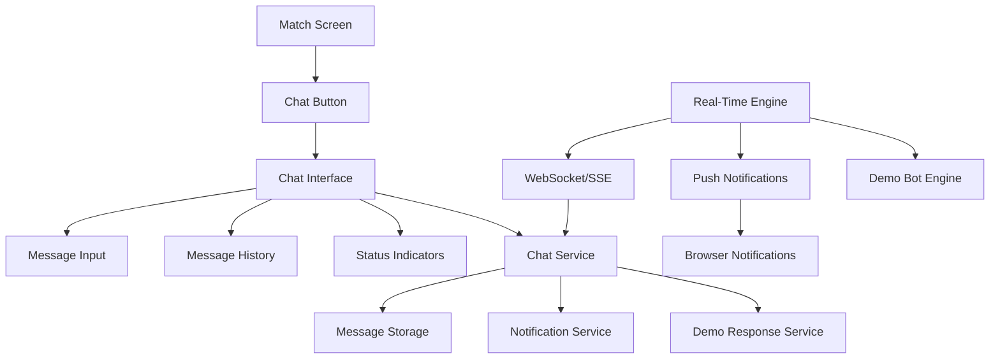

# Design Document: Chat Messaging

## Overview

The Chat Messaging feature enables real-time communication between users who have expressed mutual interest in each other. This feature bridges the gap between initial matching and the coffee meeting, allowing users to coordinate and build rapport before meeting in person.

The design prioritizes mobile-first PWA experience with push notifications, seamless integration with the existing match flow, and realistic demo user behavior for testing purposes.

## Architecture

### High-Level Architecture



### Technology Stack

**Frontend:**
- React components with real-time state management
- WebSocket or Server-Sent Events for real-time updates
- Service Worker for push notifications
- Responsive design with mobile-first approach

**Backend:**
- Express.js with WebSocket support (ws library)
- SQLite for message persistence
- Demo response engine with predefined conversation flows

**Real-Time Communication:**
- WebSocket for bidirectional real-time messaging
- Fallback to polling for compatibility
- Connection management with automatic reconnection

## Components and Interfaces

### Frontend Components

#### ChatButton Component
```javascript
// Props: matchId, isVisible, unreadCount, onClick
```

#### ChatInterface Component
```javascript
// Props: matchId, currentUserId, isOpen, onClose
```

#### MessageList Component
```javascript
// Props: messages, currentUserId, isLoading
```

#### MessageInput Component
```javascript
// Props: onSendMessage, disabled, placeholder
```

### Backend Services

#### ChatService
- `sendMessage(fromUserId, toUserId, content)` - Send a message
- `getMessages(matchId, limit, offset)` - Get message history
- `markMessagesAsRead(matchId, userId)` - Mark messages as read
- `getUnreadCount(matchId, userId)` - Get unread count

#### DemoResponseService
- `generateResponse(message, context)` - Generate demo response
- `scheduleDelayedResponse(matchId, delay)` - Schedule delayed response
- `getResponseForStage(stage)` - Get responses for conversation stage

#### NotificationService
- `sendPushNotification(userId, payload)` - Send push notification
- `registerSubscription(userId, subscription)` - Register push subscription

## Data Models

### Message Model
```javascript
{
  id: INTEGER,
  matchId: TEXT,
  fromUserId: INTEGER,
  toUserId: INTEGER,
  content: TEXT,
  isRead: BOOLEAN,
  isFromDemo: BOOLEAN,
  createdAt: TIMESTAMP
}
```

### Chat Session Model
```javascript
{
  matchId: TEXT,
  user1Id: INTEGER,
  user2Id: INTEGER,
  lastMessageAt: TIMESTAMP,
  user1UnreadCount: INTEGER,
  user2UnreadCount: INTEGER,
  conversationStage: TEXT
}
```

### Conversation Stages
- `greeting` - Initial messages (0-2)
- `skill_discussion` - Discussing skills (3-6)
- `meeting_coordination` - Planning meeting (7-10)
- `busy_response` - Winding down (11+)

## Demo User Behavior Engine

### Conversation Flow Design

The demo response system creates realistic human-like conversations through staged responses:

#### Stage 1: Greeting (0-2 messages)
```javascript
const greetingResponses = [
  "Hi! I saw we matched - excited to learn more about your skills!",
  "Hello! Your skills look really impressive.",
  "Hey there! I think we could really help each other out."
]
```

#### Stage 2: Skill Discussion (3-6 messages)
```javascript
const skillDiscussionResponses = [
  "I've been looking for someone to help with that for a while now.",
  "How long have you been doing this? I'm always curious about people's backgrounds.",
  "I'd love to trade expertise - sounds like a great match!"
]
```

#### Stage 3: Meeting Coordination (7-10 messages)
```javascript
const meetingResponses = [
  "Should we set up that coffee meeting? I'm pretty flexible with timing.",
  "I'm free most afternoons this week if you want to grab coffee.",
  "Looking forward to meeting in person! Why don't you pick the place - I'm flexible."
]
```

#### Stage 4: Busy Response (11+ messages)
```javascript
const busyResponses = [
  "Sorry, I'm getting pretty busy with work this week. Let's definitely meet up soon though!",
  "I'm excited about our coffee meeting! I might be slow to respond for a bit.",
  "Thanks for being patient with my responses - looking forward to our meeting!"
]
```

### Response Timing Strategy

**Natural Delays:**
- Immediate responses: 10-30 seconds (20%)
- Quick responses: 1-3 minutes (50%)
- Delayed responses: 5-15 minutes (25%)
- Very delayed: 30-60 minutes (5%)

## Mobile-First Design Specifications

### Chat Interface Layout

**Mobile (< 768px):**
- Full-screen overlay when opened
- Fixed header with match name and close button
- Scrollable message area
- Fixed bottom input area

**Desktop (≥ 768px):**
- Modal dialog (500px width, 600px height)
- Centered on screen with backdrop

### Touch Interactions
- Swipe down to close chat (mobile)
- Send on Enter, new line on Shift+Enter
- Character limit indicator (500 chars)

## Database Schema Extensions

### messages table
```sql
CREATE TABLE messages (
  id INTEGER PRIMARY KEY AUTOINCREMENT,
  match_id TEXT NOT NULL,
  from_user_id INTEGER NOT NULL,
  to_user_id INTEGER NOT NULL,
  content TEXT NOT NULL,
  is_read INTEGER DEFAULT 0,
  is_from_demo INTEGER DEFAULT 0,
  created_at TEXT DEFAULT CURRENT_TIMESTAMP,
  FOREIGN KEY(from_user_id) REFERENCES users(id) ON DELETE CASCADE,
  FOREIGN KEY(to_user_id) REFERENCES users(id) ON DELETE CASCADE
);

CREATE INDEX idx_messages_match ON messages(match_id, created_at);
CREATE INDEX idx_messages_unread ON messages(to_user_id, is_read);
```

### chat_sessions table
```sql
CREATE TABLE chat_sessions (
  match_id TEXT PRIMARY KEY,
  user1_id INTEGER NOT NULL,
  user2_id INTEGER NOT NULL,
  last_message_at TEXT DEFAULT CURRENT_TIMESTAMP,
  user1_unread_count INTEGER DEFAULT 0,
  user2_unread_count INTEGER DEFAULT 0,
  conversation_stage TEXT DEFAULT 'greeting',
  created_at TEXT DEFAULT CURRENT_TIMESTAMP,
  FOREIGN KEY(user1_id) REFERENCES users(id) ON DELETE CASCADE,
  FOREIGN KEY(user2_id) REFERENCES users(id) ON DELETE CASCADE
);
```

### push_subscriptions table
```sql
CREATE TABLE push_subscriptions (
  id INTEGER PRIMARY KEY AUTOINCREMENT,
  user_id INTEGER NOT NULL,
  endpoint TEXT NOT NULL,
  p256dh_key TEXT NOT NULL,
  auth_key TEXT NOT NULL,
  created_at TEXT DEFAULT CURRENT_TIMESTAMP,
  UNIQUE(user_id, endpoint),
  FOREIGN KEY(user_id) REFERENCES users(id) ON DELETE CASCADE
);
```

## Correctness Properties

*A property is a characteristic or behavior that should hold true across all valid executions of a system—essentially, a formal statement about what the system should do. Properties serve as the bridge between human-readable specifications and machine-verifiable correctness guarantees.*

### Property 1: Chat Access Control
*For any* two users, the chat functionality should be enabled if and only if both users have expressed mutual interest in each other. Users without mutual interest should not be able to send messages.
**Validates: Requirements 1.1, 1.2, 1.3, 8.1, 10.1, 10.2**

### Property 2: Message Persistence Round-Trip
*For any* valid message sent between matched users, storing the message and then retrieving it should return an equivalent message with correct content, sender, recipient, and timestamp.
**Validates: Requirements 2.3, 2.4, 5.3, 5.4**

### Property 3: Message Chronological Ordering
*For any* set of messages in a chat session, retrieving the message history should return messages in chronological order by timestamp, regardless of the order they were stored.
**Validates: Requirements 2.6, 5.6**

### Property 4: Unread Counter Consistency
*For any* chat session, the unread counter should equal the number of messages sent to a user that have not been marked as read. Sending a message should increment the recipient's counter, and viewing messages should reset it to zero.
**Validates: Requirements 3.2, 10.6**

### Property 5: Demo User Response Timing
*For any* message sent to a demo user, the demo user should respond within 10-30 seconds with a contextually appropriate response based on the conversation stage.
**Validates: Requirements 6.1, 6.7**

### Property 6: Demo Conversation Stage Progression
*For any* conversation with a demo user, the conversation stage should progress from greeting → skill_discussion → meeting_coordination → busy_response as the message count increases, and responses should match the current stage.
**Validates: Requirements 6.2, 6.3, 6.4, 6.6**

### Property 7: Message Validation
*For any* message input, messages longer than 500 characters should be rejected, empty messages should be prevented, and messages containing potential XSS content should be sanitized.
**Validates: Requirements 8.6, 9.4**

### Property 8: Chat Privacy Isolation
*For any* user, attempting to access chat messages or history for a match they are not part of should be rejected. Users should only be able to read and send messages in their own chat sessions.
**Validates: Requirements 8.3, 8.4**

### Property 9: Chat Persistence Through Meeting Flow
*For any* matched pair, chat functionality and history should remain accessible before, during, and after the coffee meeting is scheduled and completed.
**Validates: Requirements 1.5, 1.6, 10.3, 10.4, 10.5**

### Property 10: Push Notification Delivery Rules
*For any* message sent to a user, a push notification should be sent if and only if the recipient is not currently viewing the chat. Notifications should include sender name and message preview.
**Validates: Requirements 4.2, 4.3, 4.5**

## Error Handling

### Client-Side Errors
- **Connection failures**: Show "Connecting..." indicator, retry with backoff
- **Message send failures**: Show retry button, queue for retry
- **Validation errors**: Show inline error message

### Server-Side Errors
- **Database errors**: Return 500, client retries
- **Auth failures**: Return 401, redirect to login
- **Rate limiting**: Return 429, show "Please wait" message

### Demo User Errors
- **Response generation failures**: Use fallback generic responses
- **Timing service failures**: Default to immediate responses

## Testing Strategy

### Dual Testing Approach

**Unit Tests:**
- Message validation scenarios
- Demo response selection
- Timestamp formatting
- Unread counter calculations

**Property-Based Tests:**
- Library: fast-check
- Minimum 100 iterations per property
- Each test tagged with requirement reference
- Tag format: **Feature: chat-messaging, Property {number}: {property_text}**

### Test Files
```
tests/properties/chat.property.js     # Properties 1-10
tests/unit/chat.test.js               # Unit tests
```

### Coverage Goals
- All 10 correctness properties implemented and passing
- Complete message flow tested
- Demo user behavior validated across all stages
